# Setting up the project and running

---

## Microprocessor without Interlocked Pipeline Stages ***(MIPS)***

---
***MIPS*** was a research project conducted by John L. Hennessy at Stanford University between 1981 and 1984. MIPS investigated a type of instruction set architecture (ISA) now called Reduced Instruction Set Computer (RISC), its implementation as a microprocessor with very large scale integration (VLSI) semiconductor technology, and the effective exploitation of RISC architectures with optimizing compilers.

***First*** make sure you have **xilinx** installed on your machine if not install from [xilinx](https://www.xilinx.com/support/download.html)


***Next*** thing to do is to locate the folder ***Final Year Project/ALU*** and double click on ***ALU.xpr*** to run it
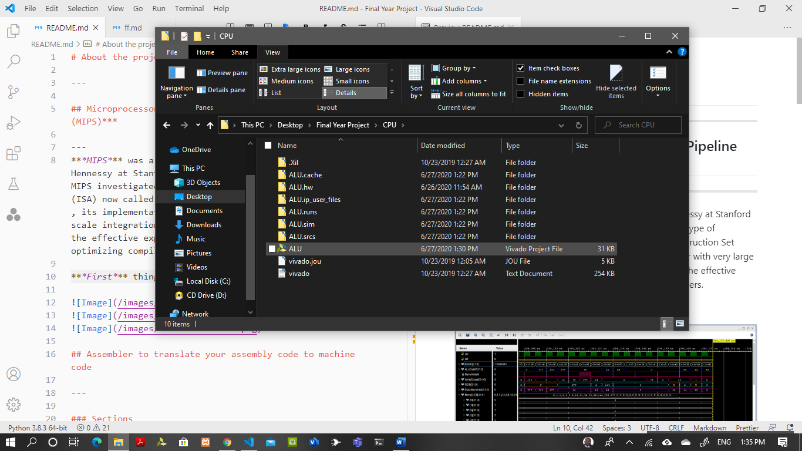

you will see an interface like this
set ***Mips*** on top from the drop down manu
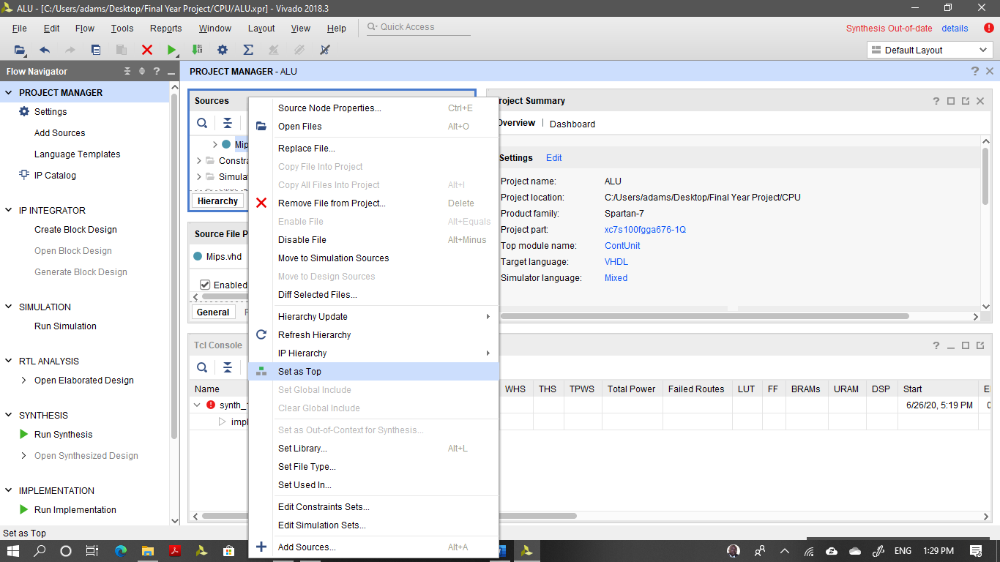

***Next*** expand the project and double click on ***InstrMemory*** to open it
To get instructions click on [Assembly code](#assembler)
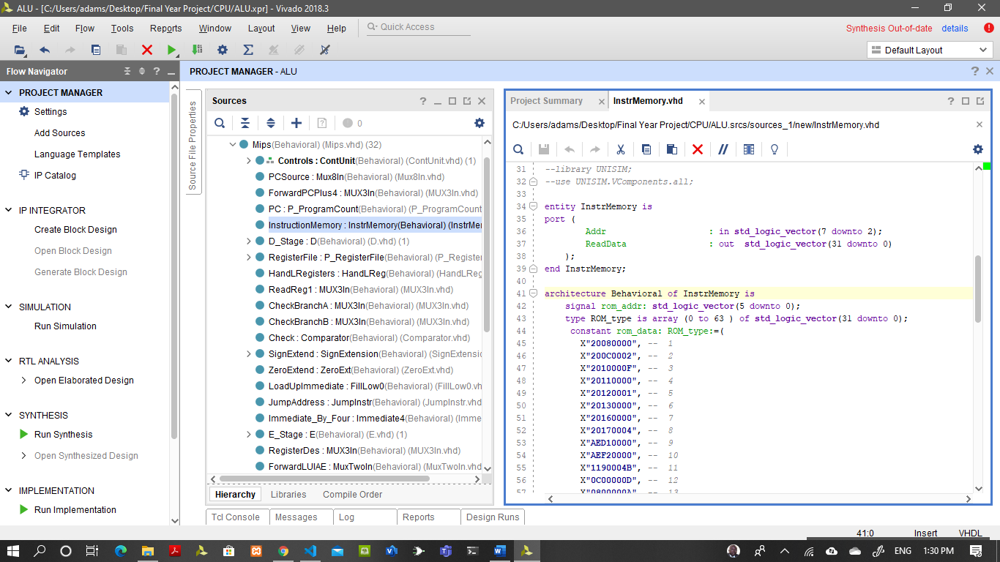

***Next*** click on simulation to simulate your instructions
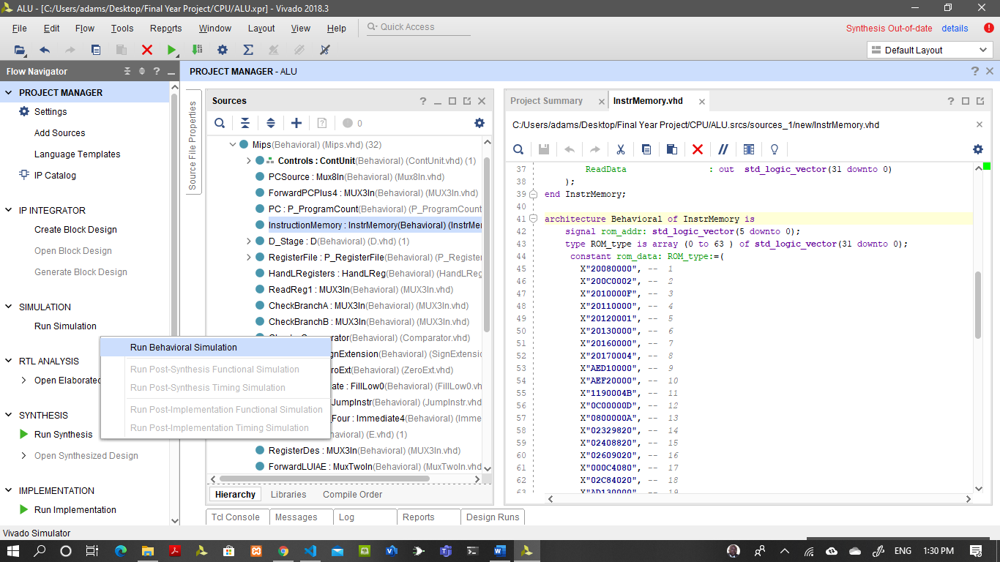
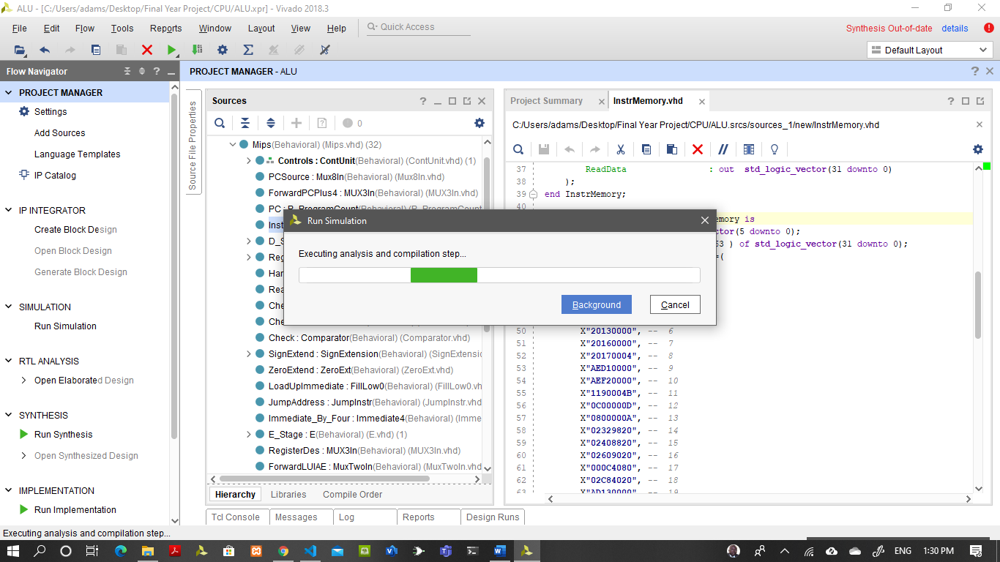

***Now*** select **DataMemory** from ***scope*** and click on it.   Click on Mem from objects and select add to ***add to wave window***
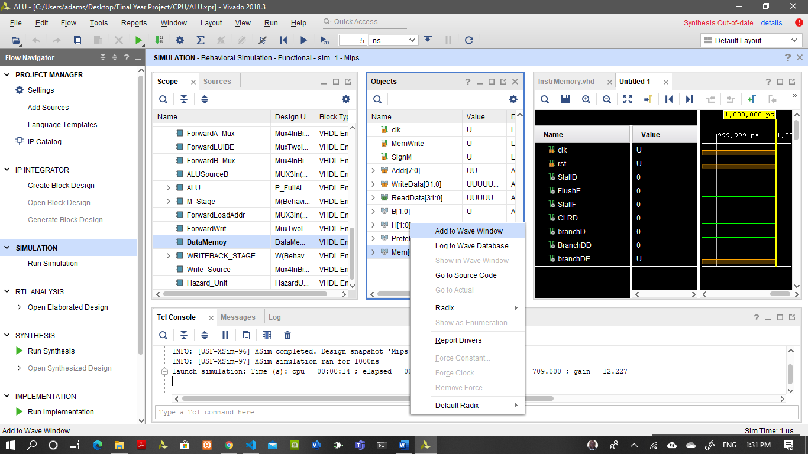

***In** the object view, click on clk and select force clock. Fill the form as it is in this readme
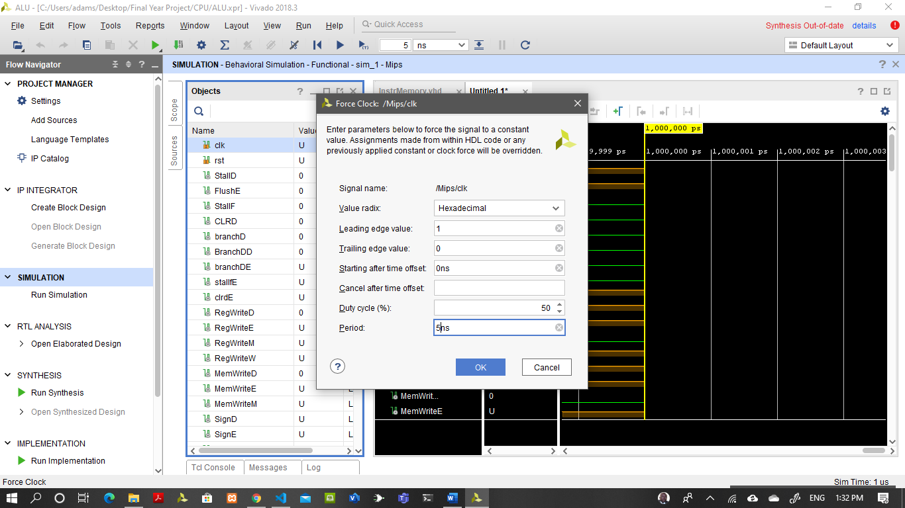

***Next** the object view, click on rst and select force constant. Fill the form as it is in this readme
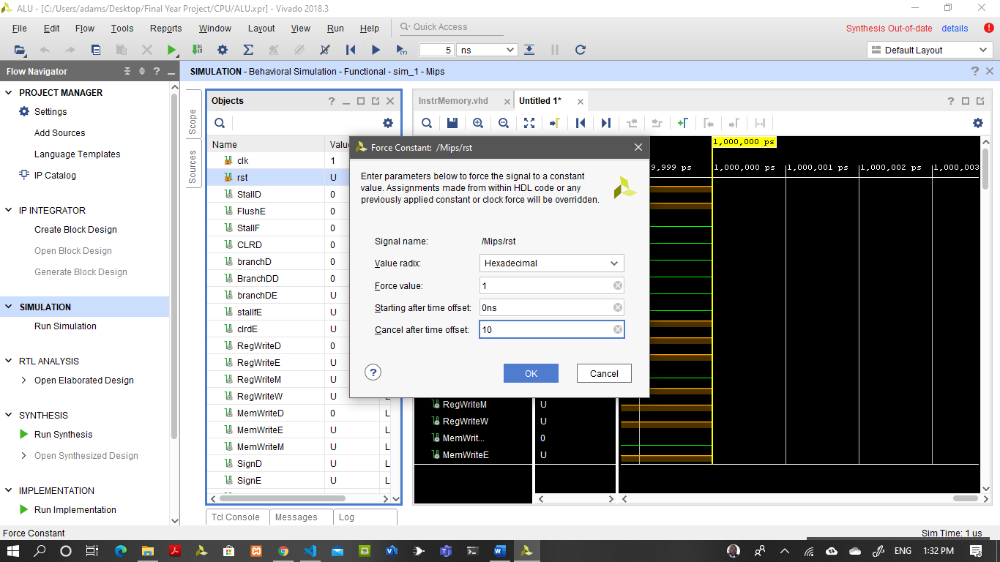

***Click on run***
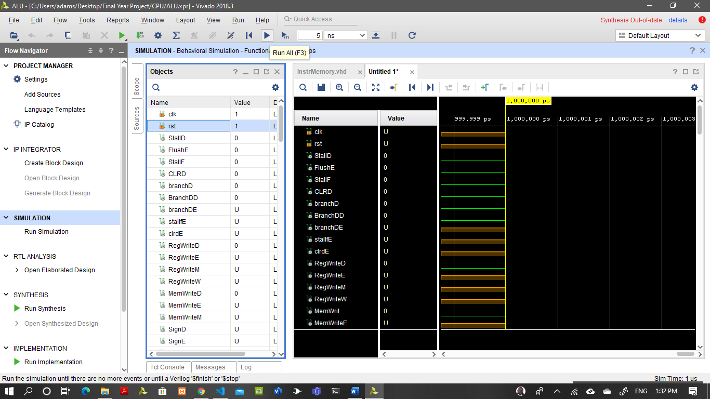
***Click on stop***
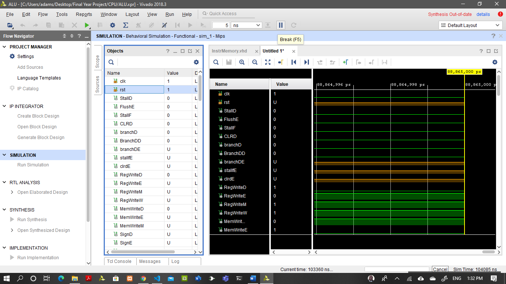
***Output***
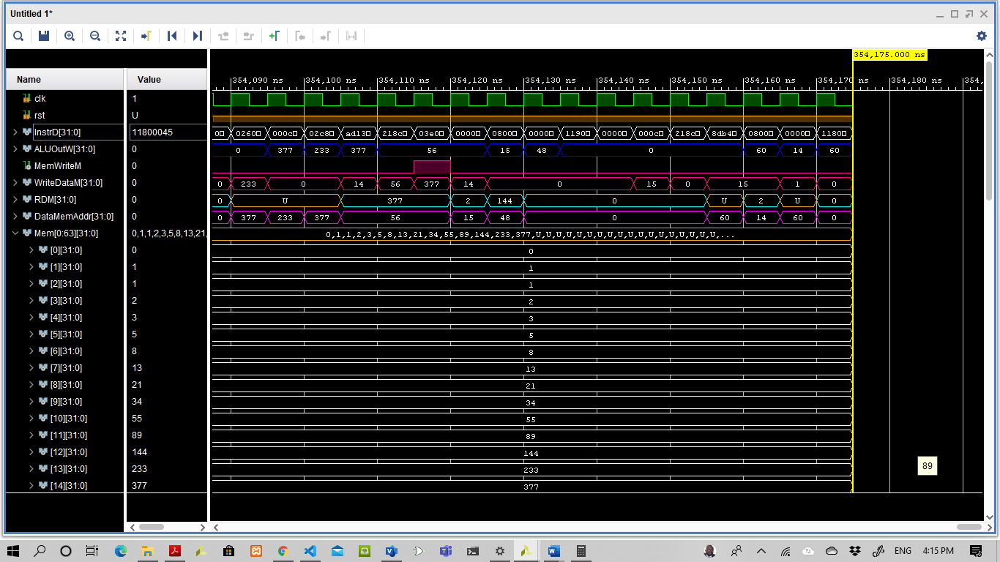

---

## Assembler to translate your assembly code to machine code

---

### Assembler

---
An assembler is a program that converts assembly language into machine code. It takes the basic commands and operations from assembly code and converts them into binary code that can be recognized by a specific type of processor.

Assemblers are similar to compilers in that they produce executable code. However, assemblers are more simplistic since they only convert low-level code (assembly language) to machine code.

to run the assembler:

---

1) Install and open vscode
2) Install julia extensions
3) Open the file ***instr.txt*** and type any MIPS instruction

>   a. ***Supported instructions for I_TYPE***
   
   ```mips
    addi, addiu, slti, sltiu, lui, lb, lh, lw, lbu, lhu, sb, sh, sw, blez, bgtz, bltz, bgez, bgezal, beq, bne, andi, ori, xori 
   ```

>   b. ***Supported instructions for R_YYPE***

   ```mips
    slt, sltu, and, or, xor, nor,mthi, mtlo, mfhi, mflo, subu, sllv, srlv, srav, sll, srl, sra, add, sub, addu
   ```

>    c. ***Supported instructions for J_YYPE***

   ```mips
    jr, jalr, jal, j 
   ```

> ***Sample instructions***

   ```mips
      #instruction to store the first 17 Fibonacci numbers starting from memmory address 0

   addi $t0, $0, 0     #   index of iterator
   addi $t4, $0, 2     #   index1 of iterator
   addi $s0, $0, 15    #   limit of loop
   addi $s1, $0, 0     #   first fibonacci num
   addi $s2, $0, 1     #   second fibonacci num
   addi $s3, $0, 0     #   container for the next fibonacci num
   addi $s6, $0, 0     #   $s6 = 0   
   addi $s7, $0, 4     #   $s7 = 4
   sw $s1, 0($s6)      #   store $s1 at $s6 
   sw $s2, 0($s7)      #   store $s2 at $s7

   loop:   beq $t4, $s0, result       #   check if index1 == limit; go to result
           jal fibonacci              #   call fibonacci()     
           j loop                     #   go to loop 

   fibonacci:      add $s3, $s1, $s2      #   add first and second
                   add $s1, $s2, $0       #   swape first with second
                   add $s2, $s3, $0       #   swape second with next
                   sll $t0, $t4, 2        #   $t0 = mul t4 by 4
                   add $t0, $s6, $t0      #   $t0 += $s6
                   sw $s3, 0($t0)         #   store next      
                   addi $t4, $t4, 1       #   $t4 += 1
                   jr $ra                 #   return to the called function

   result:    beq $t4, $0, done            #       check if $t4 == 0; go to done
                   sll $t5, $t4, 2         #       $t5 = mul t4 by 4
                   addi $t4, $t4, -1       #       $t4 -= 1
                   lw $s4, 0($t5)          #       $s4 = load the content at memory address 0($t5)
                   j result                #       go to result
        
   done:   # done

   ```

4) Now opne the file "output.jl"

you will see ***include("reads.jl")*** hold ***Ctrl*** and ***enter*** to run it

```julia
include("reads.jl")
```

5) Now open the file ***InstructionBin.txt*** or ***InstructionHex.txt*** to get the instructions

```vhdl
      20080002
      AC080000
      20090003
      AC090004
      200A0004
      AC0A0008
      200B0005
      AC0B000C
      200C0006
      AC0C0010
      200D0007
      AC0D0014
      200E0008
      AC0E0018
      200F0003
      AC0F001C
      20180002
      AC180020
      20100001
      AC100024
``` 
